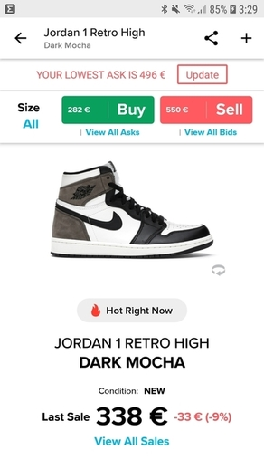
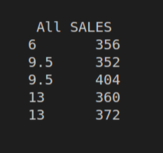
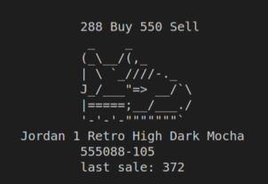
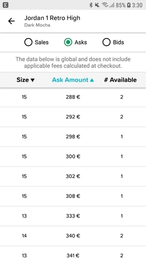

# Stockx ASCII

Practice to prepare for the JAVA exam in February, this practice proposed by our teacher of JAVA Application Programming consists of creating in JAVA the StockX website.

## Instructions

StockX was born in Detroit, and they still do things the traditional way, robust and soulful, in ASCII on the CLI.

Implements the GUI user stories provided in the GUI user stories folder, but in ASCII.

The logic behind each user story is described in the main of the main Stockx.java class.

If you have doubts, you can interact with the webapp based in London which does have (G)UI [www.stockx.com](https://stockx.com/air-jordan-1-retro-high-dark-mocha)

## Application output

Try to make the CLI output as close as possible to the images provided. Each of these corresponds to one of the user stories detailed in the following sections.

## UML class diagram / App architecture.

Follow the UML class diagram provided to build the application.
If you add any components, draw them freehand on the diagram.

## User stories / use cases

The user stories are enunciated in the main `Stockx.java` script.

1. The user requests the information about the `sneaker` in all sizes (last `sale`, maximum `bid`, minimum `ask`, `name` and `style`).

2. The user lists all the bids for a sneaker to find out what the `minimum bid` is.

3. The user lists all the asks of a sneaker to know which is the `maxima ask`.

4. The user lists all the `sales` of a sneaker to find out which is the `last sale`.

5. User requests sneaker info on all sizes (last sale, maxima bid, minimum ask, name and style) = User Story 1.

6. The user lists the sneaker info in a certain `size`.

7. The user lists all the sales of a sneaker in a certain size to find out which is the latest `size`.

8. The user lists all the bids for a sneaker in a given `size` to find out what the minimum bid is.

9. The user lists all the asks of a sneaker in a certain `size` in order to know which is the maximum ask.

## Repository

If you have any questions, please refer to the following repository indicated by our teacher: 
[dfleta](https://github.com/dfleta/stockx-ascii#readme)
